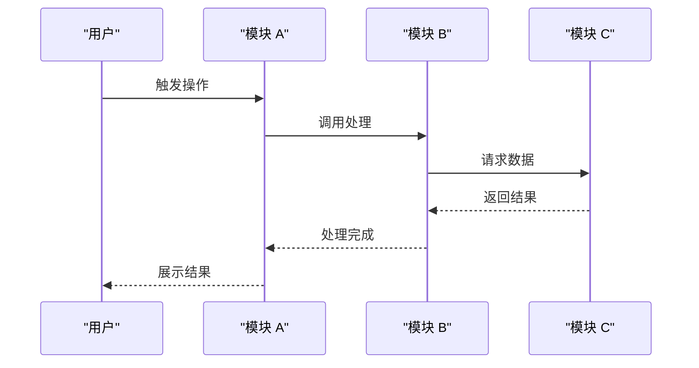
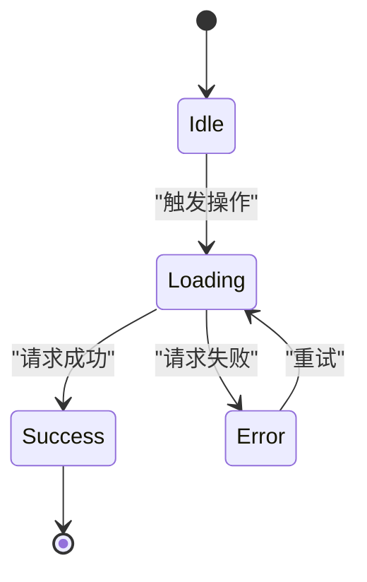
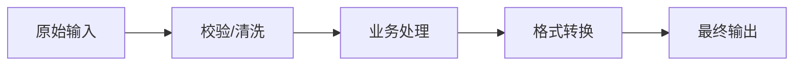

# 流程分析模板

> 流程：{流程名}
> 涉及模块：{模块列表}

---

## 一、流程概述

**做什么：** {一句话描述该流程完成的事情}

**触发条件：** {什么情况下触发该流程}

**涉及模块：** {列出该流程跨越的模块}

---

## 二、参与者交互图

{用 Mermaid sequenceDiagram 展示流程中各模块/组件之间的消息传递和调用关系}



{根据实际流程调整参与者和消息}

---

## 三、逐步分析

### 步骤 1：{步骤名}

{用文字说清楚这一步做什么，为什么这样做}

```typescript
// 文件路径:行号（如果引用真实代码）
// 或用伪代码/简化代码说明逻辑
{精简代码片段}
```

### 步骤 2：{步骤名}

{说明 + 精简代码}

### 步骤 N：{步骤名}

{持续追踪直到流程结束}

---

## 四、涉及模块速览

| 模块 | 职责 | 关键接口 |
|------|------|----------|
| {模块名} | {一句话职责} | {主要导出的函数/组件/类型} |
| ... | ... | ... |

{对流程中的关键模块，补充 1-2 段简要说明其核心实现方式}

---

## 五、状态变化图

{如果流程涉及状态变化，用 Mermaid stateDiagram-v2 展示；如不涉及可省略此节}



---

## 六、数据流转图

{如果流程涉及数据变换，用 Mermaid flowchart 展示数据从输入到输出的变换过程；如不涉及可省略此节}



---

## 七、异常与边界处理

### {异常场景 1}

**触发条件：** {什么时候出现}

**处理方式：** {怎么处理，涉及哪个模块}

### {异常场景 2}

{同上}

---

## 八、关键设计决策

### {决策 1}

**做法：** {描述实际的实现方式}

**原因：** {为什么选择这种方式，有什么取舍}

### {决策 2}

{同上}
