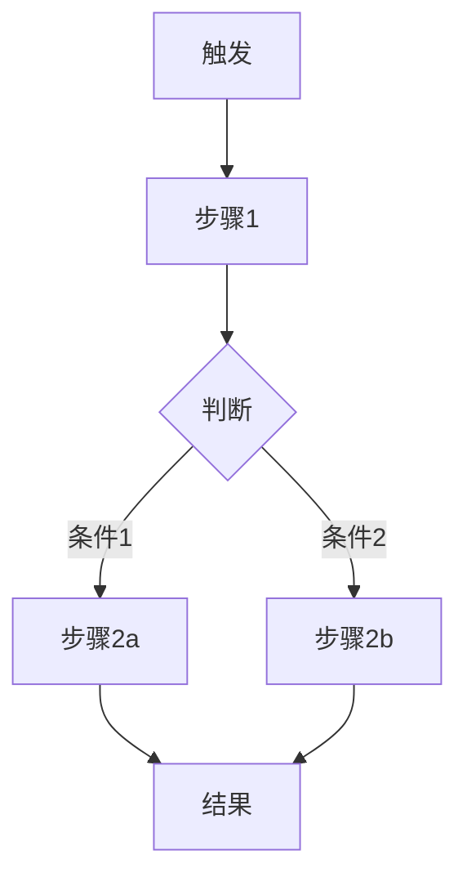

# 流程详细分析模板

> 流程：{流程名}
> 涉及文件：{关键文件路径列表}

---

## 一、流程概述

**一句话描述：** {描述该流程做什么}

**触发条件：** {什么情况下触发该流程}

**涉及模块：** {列出该流程跨越的模块}

---

## 二、流程全景图



{或使用 ASCII 流程图}

---

## 三、逐步代码追踪

### 步骤 1：{步骤名}

{描述该步骤做什么}

```typescript
// 📁 {文件路径}:{行号范围}
{真实代码}
// 🔄 数据流向：{from} → {to}
```

**关键点：**
- {解释 1}
- {解释 2}

### 步骤 2：{步骤名}

{描述}

```typescript
// 📁 {文件路径}:{行号范围}
{真实代码}
// 💡 {设计意图}
```

### 步骤 3：{步骤名}

{同上结构，持续追踪直到流程结束}

---

## 四、异常与边界处理

### 4.1 {异常场景}

**触发条件：** {什么时候出现}

**处理方式：**

```typescript
// 📁 {文件路径}:{行号}
{异常处理代码}
```

### 4.2 {另一个边界场景}

{同上}

---

## 五、性能优化

| 优化点 | 实现方式 | 位置 |
|--------|----------|------|
| {描述} | {如防抖/缓存/懒加载} | `{文件:行号}` |

```typescript
// 📁 {文件路径}:{行号}
{优化相关代码}
// ✨ {优化效果说明}
```

---

## 六、数据变化追踪

| 阶段 | 数据状态 | 存储位置 |
|------|----------|----------|
| 触发前 | {描述} | {store/state/变量} |
| 步骤 1 后 | {描述} | {store/state/变量} |
| 步骤 2 后 | {描述} | {store/state/变量} |
| 最终 | {描述} | {store/state/变量} |
