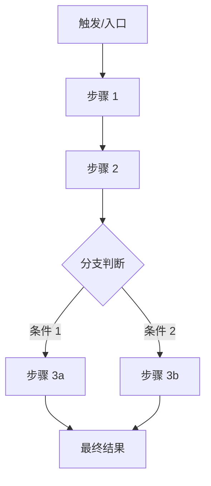
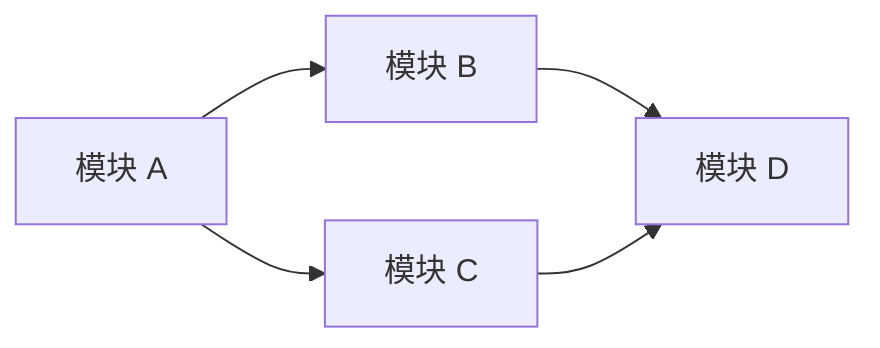

# 架构总览模板

> 分析对象：`{分析目录或文件路径}`
> 生成时间：{日期}

---

## 一、定位

{一句话说清这个项目/模块做什么，解决什么问题}

---

## 二、全景流程图

{用 Mermaid flowchart TD 展示系统的主要运行流程，从触发到最终结果经过哪些大步骤}



{根据实际情况调整，步骤中标注对应的模块名称}

---

## 三、模块关系图

{用 Mermaid flowchart LR 展示模块之间的依赖和调用关系}



{箭头表示调用/依赖方向，可用 subgraph 对模块分层}

---

## 四、技术栈

| 类别 | 技术 |
|------|------|
| 框架 | {如 React 19} |
| 状态管理 | {如 Zustand + immer} |
| 样式 | {如 TailwindCSS + Less} |
| 构建 | {如 Vite 7} |

---

## 五、目录结构

```
{精简的目录树，每个目录/文件标注职责}
```

---

## 六、核心流程清单

| 流程 | 说明 | 涉及模块 |
|------|------|----------|
| {流程名} | {一句话描述} | {模块 A, 模块 B, ...} |
| ... | ... | ... |
