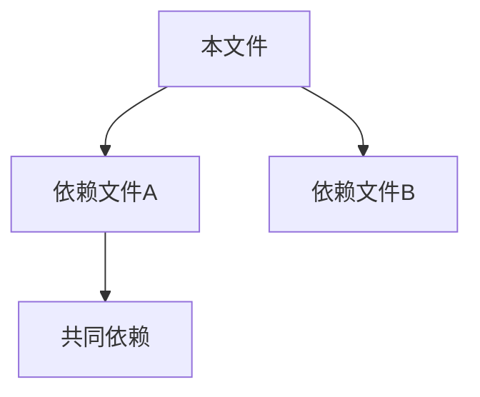

# 深入分析文档模板

生成 `01-xxx.md` 等深入分析文档时使用此模板：

```markdown
# [文件名] 深入分析

> 文件路径：[完整路径]
> 代码行数：[xxx 行]
> 复杂度：[低/中/高]

## 文件概述

[一句话说明这个文件的核心职责]

## 导出内容

| 导出项 | 类型 | 说明 |
|-------|------|------|
| `xxx` | 函数/组件/类型 | [简要说明] |

## 代码结构

```
文件结构示意：
├── 导入声明 (1-20行)
├── 类型定义 (21-50行)
├── 常量定义 (51-60行)
├── 主函数/组件 (61-200行)
│   ├── 状态初始化
│   ├── 副作用处理
│   └── 渲染逻辑
└── 辅助函数 (201-250行)
```

## 核心逻辑解读

### [逻辑块1名称]

**位置**：[文件:行号范围]

**作用**：[说明这段代码要解决什么问题]

```typescript
// [文件路径:行号范围]
// 关键代码片段
const xxx = () => {
  // 👆 这里的关键点：[解释]

  // 💡 为什么这样写：[解释设计意图]
}
```

**要点**：
- [关键点1]
- [关键点2]

### [逻辑块2名称]

...

## 设计模式

### [模式名称]

**识别特征**：
```typescript
// 代码示例展示模式特征
```

**使用场景**：[什么情况下使用这个模式]

**好处**：
- [好处1]
- [好处2]

**在本文件中的应用**：[具体说明]

## 状态管理

### 内部状态

| 状态 | 类型 | 初始值 | 用途 |
|-----|------|-------|------|
| `xxx` | `Type` | `value` | [用途] |

### 外部状态依赖

- `useXxx()` - [从哪里来，用来做什么]

## 依赖分析

### 内部依赖



### 被依赖情况

此文件被以下文件引用：
- `[路径]` - [如何使用]

## 实现亮点

### 1. [亮点名称]

**代码位置**：[文件:行号]

```typescript
// 展示优秀实现
```

**为什么好**：[解释这个实现的优点]

**可借鉴场景**：[什么时候可以参考这种写法]

### 2. [亮点名称]

...

## 潜在改进点

> 仅作学习参考，不代表需要修改

- [观察1]：[解释]
- [观察2]：[解释]

## 学习收获

阅读这个文件，你可以学到：

1. **[知识点1]**：[简要说明]
2. **[知识点2]**：[简要说明]
3. **[知识点3]**：[简要说明]

## 相关文件

建议结合以下文件一起阅读：

- `[文件路径]` - [关联原因]
```
