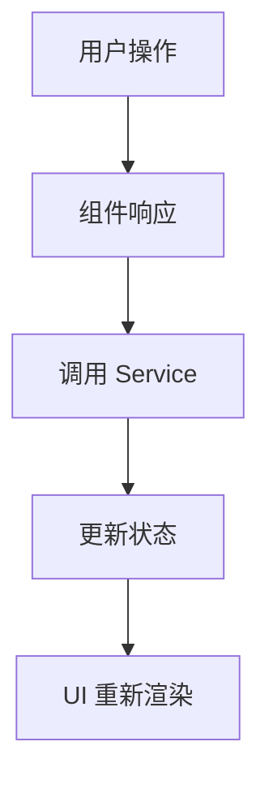
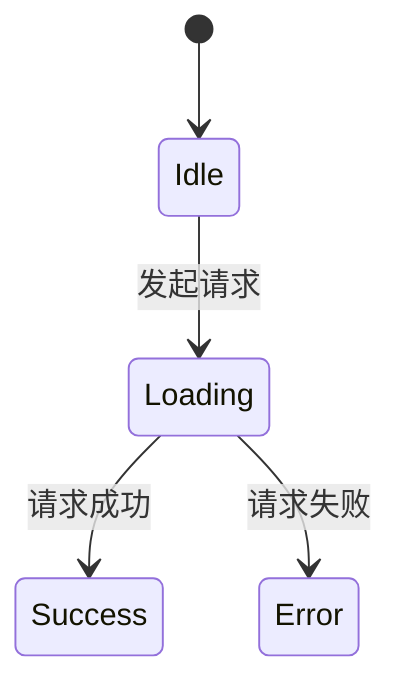
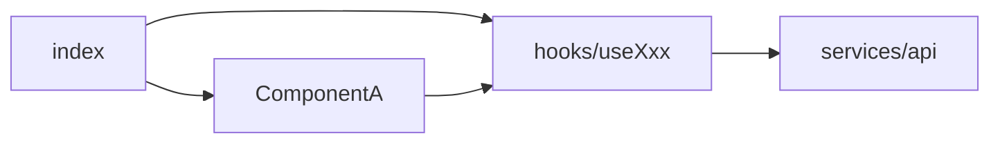

# 概览文档模板

生成 `00-overview.md` 时使用此模板结构：

```markdown
# [项目/目录名称] 代码分析

> 分析时间：[日期]
> 分析路径：[完整路径]

## 概述

[一段话描述这个项目/目录是做什么的，解决什么问题]

## 技术栈

| 类别 | 技术 |
|-----|------|
| 框架 | React/Vue/... |
| 语言 | TypeScript x.x |
| 状态管理 | Zustand/Redux/RxJS/... |
| 样式方案 | TailwindCSS/Less/... |
| 构建工具 | Vite/Webpack/... |

## 目录结构

```
[目录名]/
├── index.ts          # 入口文件，导出 xxx
├── components/       # UI 组件
│   ├── Header/       # 头部组件
│   └── ...
├── hooks/            # 自定义 Hooks
├── services/         # 服务层/API 调用
├── types/            # TypeScript 类型定义
└── utils/            # 工具函数
```

## 核心入口

入口文件：`[路径]`

```typescript
// [文件路径:行号范围]
// 关键代码片段，展示主要导出和结构
```

## 核心流程

### 主流程图



### 流程代码追踪

> 以下逐步展示核心流程的代码实现，帮助你理解数据如何流转

#### 步骤 1：[触发点名称]

[简要说明这一步做什么]

```typescript
// 📁 [文件路径:行号范围]
// 👇 这是流程的起点
export const handleXxx = () => {
  // 💡 为什么这样设计：[解释]
  doSomething()
}
```

#### 步骤 2：[处理层名称]

[简要说明这一步做什么]

```typescript
// 📁 [文件路径:行号范围]
export const doSomething = async () => {
  // 🔄 数据从这里流向 store
  const result = await api.fetch()
  store.update(result)  // 👆 状态更新点
}
```

#### 步骤 3：[状态更新]

[简要说明状态如何更新]

```typescript
// 📁 [文件路径:行号范围]
// ✨ 这里使用了 [xxx模式] 来管理状态
export const store = create((set) => ({
  data: null,
  update: (data) => set({ data })  // 👆 状态变更触发 UI 更新
}))
```

### 流程小结

| 步骤 | 文件 | 关键函数 | 作用 |
|-----|------|---------|------|
| 1 | `Component.tsx:45` | `handleXxx` | 触发流程 |
| 2 | `service.ts:20` | `doSomething` | 业务处理 |
| 3 | `store.ts:10` | `update` | 状态更新 |

## 状态管理

### 状态定义

```typescript
// 📁 [状态文件路径:行号范围]
// 👇 核心状态结构
interface State {
  data: DataType | null
  loading: boolean
  error: Error | null
}

// 💡 使用 [Zustand/RxJS/Context] 管理状态的原因：[解释]
export const useStore = create<State>((set) => ({
  data: null,
  loading: false,
  error: null,
  // ✨ action 定义
  fetchData: async () => {
    set({ loading: true })
    // ...
  }
}))
```

### 状态流转图



### 状态使用示例

```typescript
// 📁 [组件文件:行号]
// 👇 组件中如何消费状态
const Component = () => {
  const { data, loading, fetchData } = useStore()
  // 🔄 状态变化自动触发重渲染
  useEffect(() => { fetchData() }, [])
}
```

## 关键文件速览

| 文件 | 职责 | 重要程度 |
|-----|------|---------|
| `index.ts` | 入口，导出主模块 | ⭐⭐⭐ |
| `hooks/useXxx.ts` | xxx 逻辑 | ⭐⭐⭐ |
| `services/api.ts` | API 调用 | ⭐⭐ |

## 依赖关系

### 内部依赖



### 外部依赖

- `[包名]` - [用途说明]

## 快速上手

要理解这个模块，建议按以下顺序阅读：

1. `[文件1]` - 了解整体结构
2. `[文件2]` - 理解核心逻辑
3. `[文件3]` - 掌握状态管理
```
