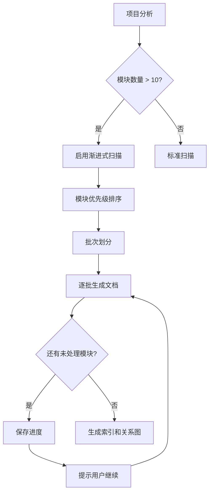

# 大型项目渐进式扫描策略

> 📖 本文件为 [SKILL.md](../SKILL.md) 的详细补充

---

## 触发条件

当项目满足以下**任一条件**时，必须使用渐进式扫描策略：

| 条件 | 阈值 |
|------|------|
| 模块数量 | > 10 |
| 源文件数量 | > 50 |
| 代码行数 | > 10,000 |

---

## 渐进式扫描流程



---

## 模块优先级排序

按以下维度计算优先级分数：

| 维度 | 权重 | 说明 |
|------|------|------|
| 入口点 | 5 | main.py, index.ts 等 |
| 被依赖次数 | 4 | 被其他模块 import 的次数 |
| 有现有文档 | 3 | README 或 docs 存在 |
| 代码行数 | 2 | 较大的模块优先 |
| 最近修改 | 1 | 最近修改的优先 |

---

## 批次划分策略

**关键：每批 1-2 个模块，深度基于模块复杂度动态调整**

```yaml
batch_config:
  batch_size: 1              # 每批处理 1-2 个模块
  quality_mode: dynamic      # dynamic / fixed
  pause_between_batches: true
  auto_continue: false
```

**批次分配示例**（按业务领域 + 复杂度）：

| 批次 | 内容 | 复杂度 | 期望行数 |
|------|------|--------|----------|
| 1 | `index.md` + `architecture.md` | - | 150+ 每个 |
| 2 | `工作流系统/编辑器核心.md` | 2000 行源码, 15 导出 | 600+ |
| 3 | `AI系统/Agent客户端.md` | 1500 行源码, 12 导出 | 450+ |
| 4 | `状态管理/Store.md` | 500 行源码, 8 导出 | 250+ |
| 5 | `服务层/API服务.md` | 300 行源码, 5 导出 | 150+ |

---

## 进度跟踪

在 `cache/progress.json` 中记录：

```json
{
  "version": "3.0.8",
  "total_modules": 25,
  "completed_modules": ["core", "utils", "api"],
  "pending_modules": ["auth", "db"],
  "current_batch": 2,
  "last_updated": "2026-01-28T21:15:00Z",
  "quality_version": "professional-v2"
}
```

---

## 断点续传

当用户说 **"继续生成 wiki"** 或 **"continue wiki generation"** 时：
1. 读取 `cache/progress.json`
2. 跳过已完成的模块
3. 从下一批次继续

---

## 每批次质量检查

生成每批后，必须验证质量：

```bash
python scripts/check_quality.py .mini-wiki --verbose
```

**质量门槛（动态计算）**：

| 指标 | 计算方式 | 未达标处理 |
|------|----------|-----------|
| 行数 | `max(150, source_lines × 0.3 + export_count × 15)` | 重新生成 |
| 章节数 | `6 + role_weight` | 补充章节 |
| 图表数 | `max(1, files / 5)` | 添加图表 |
| 代码示例 | `max(2, exports × 0.5)` | 补充示例 |
| 源码追溯 | 每章节必需 | 添加引用 |

**质量评级**：

| 等级 | 说明 |
|------|------|
| 🟢 Professional | 超过期望值 120%+ |
| 🟡 Standard | 达到期望值 80-120% |
| 🔴 Basic | 低于期望值 80% |

---

## 用户交互提示

每批次完成后，向用户报告：

```
✅ 第 2 批完成 (6/25 模块)

已生成:
- 工作流系统/编辑器核心.md (312 行, Professional ✅)
- 工作流系统/节点系统.md (245 行, Standard 🟡)

质量检查: 全部通过 ✅

待处理: 19 个模块
预计还需: 10 批次

👉 输入 "继续" 生成下一批
👉 输入 "检查质量" 运行质量检查
👉 输入 "重新生成 <模块名>" 重新生成特定模块
```

---

## 配置选项

```yaml
# .mini-wiki/config.yaml
progressive:
  enabled: auto               # auto / always / never
  batch_size: 1               # 每批模块数（1-2 确保深度）
  quality_check: true         # 每批后自动检查质量
  auto_continue: false        # 自动继续无需确认

domain_hierarchy:
  enabled: true               # 启用业务领域分层
  auto_detect: true           # 自动识别业务领域
  language: zh                # 目录名语言 (zh/en)
  priority_weights:           # 自定义优先级权重
    entry_point: 5
    dependency_count: 4
    code_lines: 2
    has_docs: 3
    recent_modified: 1
  skip_modules:               # 跳过的模块
    - __tests__
    - examples
```
