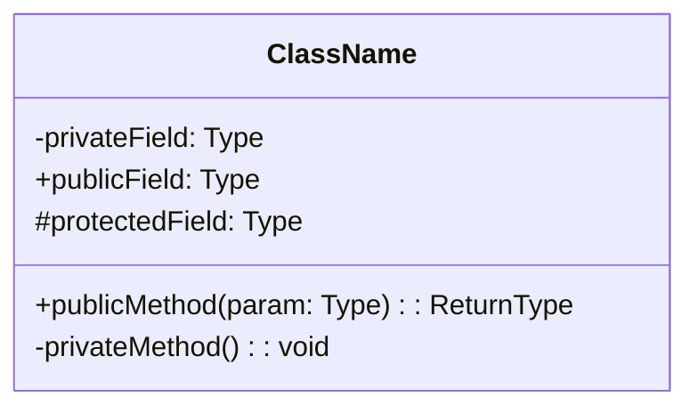
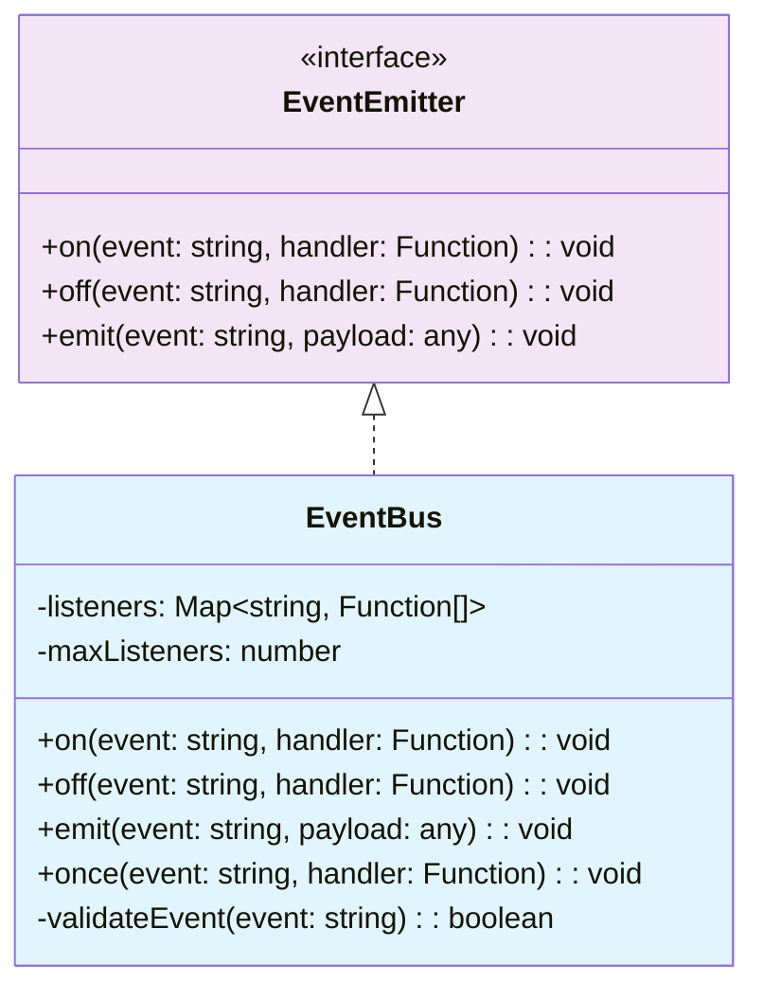
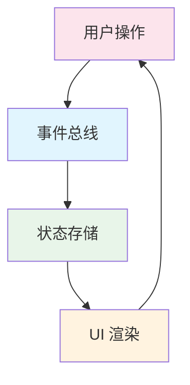

# Quality Standards Reference / 质量标准参考

> 本文档定义了 Mini-Wiki 文档生成的完整质量标准体系，包括动态质量公式、等级定义、章节要求、图表规范等。
> 主 SKILL.md 通过引用本文档来执行质量控制。

---

## Table of Contents

- [Dynamic Quality Standards / 动态质量标准](#dynamic-quality-standards--动态质量标准)
- [Quality Levels / 质量等级定义](#quality-levels--质量等级定义)
- [Required Sections / 模块文档必需章节](#required-sections--模块文档必需章节)
- [Diagram Requirements / 图表要求](#diagram-requirements--图表要求)
- [Source Traceability / 源码追溯规范](#source-traceability--源码追溯规范)
- [Code Example Standards / 代码示例标准](#code-example-standards--代码示例标准)
- [classDiagram Standards / classDiagram 规范](#classdiagram-standards--classdiagram-规范)
- [Cross-Linking / 文档关联规范](#cross-linking--文档关联规范)
- [Domain Auto-Detection / 业务领域自动检测](#domain-auto-detection--业务领域自动检测)
- [Mermaid Diagram Standards / Mermaid 图表规范](#mermaid-diagram-standards--mermaid-图表规范)

---

## Dynamic Quality Standards / 动态质量标准

文档质量不应使用固定阈值衡量，而应根据模块自身的复杂度动态计算期望值。

### 复杂度评估因子

在分析模块时，首先采集以下指标：

| 因子 | 变量名 | 说明 |
|------|--------|------|
| 源码总行数 | `source_lines` | 模块内所有源文件的有效代码行数（不含空行和纯注释行） |
| 文件数量 | `file_count` | 模块内源文件总数 |
| 导出数量 | `export_count` | 模块对外暴露的公共 API 数量（函数、类、类型、常量等） |
| 依赖数量 | `dependency_count` | 模块直接引用的外部包和内部模块数量 |
| 模块角色 | `module_role` | 模块在项目中的角色分类（core / util / config / test） |
| 模块角色权重 | `module_role_weight` | 根据 `module_role` 映射的数值权重 |

### 动态质量公式

根据采集到的因子，动态计算各维度的期望值：

| 维度 | 公式 | 说明 |
|------|------|------|
| 文档行数 | `max(150, source_lines × 0.3 + export_count × 15)` | 确保最低 150 行基础覆盖，复杂模块按比例增长 |
| 代码示例数 | `max(2, export_count × 0.5)` | 每 2 个导出 API 至少 1 个示例，最少 2 个 |
| 图表数量 | `max(1, ceil(file_count / 5))` | 每 5 个文件至少 1 张图表，最少 1 张 |
| 章节数 | `6 + module_role_weight` | 基础 6 章节，核心模块最多 10 章节 |

### 模块角色权重表

| 模块角色 | `module_role` | `module_role_weight` | 典型特征 |
|----------|---------------|----------------------|----------|
| 核心模块 | `core` | +4 | 项目的主要业务逻辑，被多个模块依赖 |
| 工具模块 | `util` | +2 | 通用工具函数、辅助类库 |
| 配置模块 | `config` | +1 | 配置文件、常量定义、环境变量 |
| 测试模块 | `test` | +0 | 测试文件、测试工具、Mock 数据 |

**角色判定规则**：
1. 包含 `core`、`main`、`engine`、`service` 等关键词 → `core`
2. 包含 `util`、`helper`、`lib`、`shared`、`common` 等关键词 → `util`
3. 包含 `config`、`constant`、`env`、`setting` 等关键词 → `config`
4. 包含 `test`、`spec`、`__test__`、`__mock__` 等关键词 → `test`
5. 无法匹配时默认为 `util`

### 项目类型适配表

不同项目类型在文档侧重点上有所差异：

| 项目类型 | 额外侧重章节 | 代码示例偏好 | 图表偏好 |
|----------|-------------|-------------|----------|
| `frontend` | 组件用法、Props 说明、样式约定 | JSX/TSX 示例优先 | 组件树图、状态流图 |
| `backend` | API 端点、中间件、数据库 Schema | 请求/响应示例 | 架构图、时序图 |
| `fullstack` | 前后端交互、数据流 | 全链路示例 | 系统架构图、数据流图 |
| `library` | API 文档、泛型用法、扩展点 | 独立可运行示例 | 类图、依赖图 |
| `cli` | 命令说明、参数列表、使用场景 | 终端命令示例 | 流程图、决策树 |

### 语言适配表

| 语言 | 代码示例格式 | 类型标注要求 | 特殊考虑 |
|------|-------------|-------------|----------|
| `TypeScript` | TS 代码块，含完整类型 | 必须包含类型签名 | 泛型用法、类型导出 |
| `Python` | Python 代码块，含 type hints | 推荐 type hints | docstring 风格 |
| `Go` | Go 代码块 | 接口定义 | godoc 兼容格式 |
| `Rust` | Rust 代码块 | 完整生命周期标注 | trait 实现、错误类型 |

---

## Quality Levels / 质量等级定义

根据实际文档指标与动态期望值的比值，划分三个质量等级：

| 等级 | 标识 | 达标比率 | 说明 |
|------|------|----------|------|
| Professional | 🟢 | ≥ 120% | 超过动态期望值 120%，文档质量优秀 |
| Standard | 🟡 | 80% ~ 120% | 达到动态期望值的 80%-120%，满足基本质量要求 |
| Basic | 🔴 | < 80% | 低于动态期望值 80%，需要补充完善 |

**等级计算方式**：

对每个维度分别计算达标比率，取所有维度的加权平均值作为最终等级：

```
维度达标率 = 实际值 / 期望值 × 100%

总达标率 = (文档行数达标率 × 0.3)
         + (代码示例达标率 × 0.3)
         + (图表数量达标率 × 0.2)
         + (章节数达标率 × 0.2)
```

**各维度权重说明**：
- 文档行数（0.3）：反映内容的完整性和深度
- 代码示例（0.3）：AI 和开发者最直接的参考依据
- 图表数量（0.2）：可视化辅助理解架构关系
- 章节数（0.2）：结构完整性

---

## Required Sections / 模块文档必需章节

根据模块角色动态决定必需章节。`✅` 表示必需，`⚡` 表示推荐，`-` 表示可省略。

| 章节 | `core` | `util` | `config` | 说明 |
|------|--------|--------|----------|------|
| 概述（Overview） | ✅ | ✅ | ✅ | 模块定位、职责边界、一句话描述 |
| 核心功能（Core Features） | ✅ | ✅ | ⚡ | 主要功能点列举与说明 |
| 目录结构（Directory Structure） | ✅ | ⚡ | - | 文件组织方式、各文件职责 |
| API / 接口（API Reference） | ✅ | ✅ | ⚡ | 导出函数、类、类型的详细签名 |
| 代码示例（Code Examples） | ✅ | ✅ | ⚡ | 可运行的使用示例 |
| 最佳实践（Best Practices） | ✅ | ⚡ | - | 推荐用法、常见模式 |
| 性能优化（Performance） | ✅ | - | - | 性能关键点、优化建议 |
| 错误处理（Error Handling） | ✅ | ⚡ | - | 错误类型、异常处理策略 |
| 依赖关系（Dependencies） | ✅ | ✅ | ✅ | 上下游依赖、版本要求 |
| 相关文档（Related Docs） | ✅ | ✅ | ✅ | 关联模块文档的交叉引用链接 |

**章节数计算**：
- `core`：10 个章节全部必需（6 + 4 = 10）
- `util`：基础 6 + 推荐 2 = 8 个章节
- `config`：基础 6 + 推荐 1 = 7 个章节
- `test`：仅基础 6 个章节

---

## Diagram Requirements / 图表要求

### 内容类型与图表类型映射

| 内容类型 | 图表类型 | Mermaid 声明 | 适用场景 |
|----------|---------|-------------|----------|
| 架构概览 | 流程图（自上而下） | `flowchart TB` | 模块整体架构、层级关系 |
| 数据流 | 时序图 | `sequenceDiagram` | 请求链路、事件传播、异步流程 |
| 状态变更 | 状态图 | `stateDiagram-v2` | 状态机、生命周期、UI 状态 |
| 类/接口关系 | 类图 | `classDiagram` | 类继承、接口实现、组合关系 |
| 依赖关系 | 流程图（左到右） | `flowchart LR` | 模块间依赖、包依赖 |

### 图表数量指导

| 模块文件数 | 最少图表数 | 推荐图表组合 |
|-----------|-----------|-------------|
| 1-5 | 1 | 架构概览 |
| 6-10 | 2 | 架构概览 + 数据流 / 类图 |
| 11-20 | 3 | 架构概览 + 数据流 + 类图 |
| 21+ | 4+ | 架构概览 + 数据流 + 类图 + 状态图 |

---

## Source Traceability / 源码追溯规范

### 路径格式

**必须使用相对路径**（从文档文件位置出发），**禁止使用 `file://` 协议**。

```markdown
**源码引用**
- [`filename.ts` L1-L50](../../../src/path/to/file.ts)
```

### 完整示例

```markdown
## 核心功能

### 事件调度器

事件调度器负责管理所有模块间的事件通信。

**源码引用**
- [`eventDispatcher.ts` L15-L80](../../../src/core/eventDispatcher.ts)
- [`eventTypes.ts` L1-L30](../../../src/types/eventTypes.ts)
```

### 链接样式配置

可通过 `config.yaml` 的 `linking.source_link_style` 字段配置链接风格：

| 配置值 | 格式 | 说明 |
|--------|------|------|
| `relative`（默认） | `[file.ts](../../../src/file.ts)` | 相对路径，适用于本地浏览 |
| `github_url` | `[file.ts](https://github.com/org/repo/blob/main/src/file.ts)` | GitHub 链接，适用于远程协作 |

### 追溯粒度要求

| 文档章节 | 追溯要求 |
|----------|---------|
| API / 接口 | 每个导出 API 必须关联源码位置 |
| 核心功能 | 每个功能点至少一个源码引用 |
| 代码示例 | 标注示例代码对应的真实源码位置 |
| 架构概览 | 关键架构组件标注所在文件 |

---

## Code Example Standards / 代码示例标准

> **目标受众**：AI 系统和架构评审人员。代码示例需要足够完整和精确，使 AI 能直接理解模块用法。

### 基本要求

每个代码示例必须满足以下标准：

1. **完整可运行** — 包含完整的 import 语句、初始化代码、函数调用和结果输出
2. **覆盖导出接口** — 尽可能覆盖模块的主要导出 API
3. **包含注释说明** — 关键步骤添加中文注释
4. **适配项目语言** — 使用项目实际的编程语言和框架

### 示例模板

```typescript
// ✅ 良好的代码示例
import { EventBus } from '../core/eventBus';
import { AppEvent } from '../types/events';

// 1. 初始化事件总线
const bus = EventBus.create({
  maxListeners: 100,
  enableLogging: true,
});

// 2. 注册事件监听
bus.on(AppEvent.UserLogin, (payload) => {
  console.log('用户登录:', payload.userId);
});

// 3. 触发事件
bus.emit(AppEvent.UserLogin, { userId: 'u-123', timestamp: Date.now() });

// 4. 预期输出: "用户登录: u-123"
```

```typescript
// ❌ 不合格的代码示例（缺少 import、初始化、注释）
bus.emit('login', { id: 123 });
```

### 示例数量动态调整表

| 导出 API 数量 | 最少示例数 | 推荐覆盖策略 |
|--------------|-----------|-------------|
| 1-3 | 2 | 每个 API 一个基础示例 |
| 4-6 | 3 | 核心 API 独立示例 + 1 个组合示例 |
| 7-10 | 5 | 按功能分组，每组一个示例 |
| 11-20 | 8 | 按功能分组 + 高级用法示例 |
| 21+ | 10+ | 按功能分组 + 高级用法 + 集成示例 |

### 示例分类

| 分类 | 何时使用 | 特点 |
|------|---------|------|
| 基础用法 | 每个模块必须 | 最简单的使用路径 |
| 高级用法 | `core` 模块必须 | 泛型、配置、扩展点 |
| 集成示例 | 多模块交互时 | 展示模块间协作 |
| 错误处理 | `core` 模块推荐 | try-catch、边界情况 |

---

## classDiagram Standards / classDiagram 规范

对每个核心 class / interface 必须提供 classDiagram，遵循以下规范：

### 基本结构



### 关系表示

| 关系类型 | 符号 | 示例 |
|----------|------|------|
| 继承 | `<\|--` | `Animal <\|-- Dog` |
| 实现 | `<\|..` | `Flyable <\|.. Bird` |
| 组合 | `*--` | `Car *-- Engine` |
| 聚合 | `o--` | `Team o-- Player` |
| 依赖 | `..>` | `Client ..> Service` |
| 关联 | `-->` | `Order --> Product` |

### 完整示例



### 要求清单

- 所有公共方法必须列出完整签名（参数类型 + 返回类型）
- 使用可见性修饰符（`+` / `-` / `#`）
- 接口使用 `<<interface>>` 标注
- 抽象类使用 `<<abstract>>` 标注
- 使用 `style` 定义颜色区分不同类型的类

---

## Cross-Linking / 文档关联规范

### 关联要求

每份模块文档的「相关文档」章节必须包含：

| 关联类型 | 说明 | 示例 |
|----------|------|------|
| 上游依赖 | 本模块依赖的模块文档 | `[事件系统](./event-system.md)` |
| 下游消费者 | 依赖本模块的模块文档 | `[工作流引擎](./workflow-engine.md)` |
| 同层关联 | 同一层级的相关模块文档 | `[状态管理](./state-management.md)` |
| 外部参考 | 关键外部依赖的官方文档 | `[RxJS 文档](https://rxjs.dev/)` |

### 链接格式

```markdown
## 相关文档

### 内部文档
- [事件系统](./event-system.md) — 本模块的事件通信基础
- [类型定义](./type-definitions.md) — 共享类型声明

### 外部文档
- [RxJS 官方文档](https://rxjs.dev/) — 响应式编程框架
- [Zustand](https://github.com/pmndrs/zustand) — 状态管理库
```

### 孤立文档检测

生成完成后应检查是否存在「孤立文档」— 即没有被任何其他文档引用的模块文档。孤立文档应至少被索引页（`README.md`）引用。

---

## Domain Auto-Detection / 业务领域自动检测

### 领域映射表 (domain_mapping)

通过扫描模块的文件名、目录名、import 语句和关键代码标识符，自动检测模块所属业务领域：

```yaml
domain_mapping:
  工作流系统:
    keywords: [workflow, flow, node, edge, canvas, xyflow]
    typical_patterns: ["**/flow/**", "**/workflow/**", "**/canvas/**"]
    doc_emphasis: [状态图, 节点类型表, 边类型表]

  AI系统:
    keywords: [agent, ai, llm, chat, mcp, tool, cloud-agent]
    typical_patterns: ["**/ai/**", "**/agent/**", "**/chat/**"]
    doc_emphasis: [Prompt 模板, 工具链说明, 模型配置]

  事件系统:
    keywords: [event, bus, emitter, rxjs, observable]
    typical_patterns: ["**/event/**", "**/bus/**"]
    doc_emphasis: [事件类型表, 时序图, 订阅模式]

  状态管理:
    keywords: [store, state, slice, zustand, redux]
    typical_patterns: ["**/store/**", "**/state/**"]
    doc_emphasis: [状态流转图, Store 结构, Action 列表]

  服务层:
    keywords: [service, api, request, http, fetch]
    typical_patterns: ["**/service/**", "**/api/**"]
    doc_emphasis: [API 端点表, 请求/响应格式, 错误码]

  组件库:
    keywords: [component, ui, widget, panel, sidebar]
    typical_patterns: ["**/components/**", "**/ui/**"]
    doc_emphasis: [Props 表, 组件树, 使用示例]

  多媒体:
    keywords: [media, video, audio, ffmpeg, canvas, konva]
    typical_patterns: ["**/media/**", "**/video/**", "**/audio/**"]
    doc_emphasis: [编解码流程, 格式支持表, 性能参数]

  存储系统:
    keywords: [storage, persist, cache, db, database]
    typical_patterns: ["**/storage/**", "**/cache/**", "**/db/**"]
    doc_emphasis: [数据模型图, 缓存策略, 持久化流程]

  编辑器:
    keywords: [editor, tiptap, markdown, document, rich-text]
    typical_patterns: ["**/editor/**", "**/document/**"]
    doc_emphasis: [文档模型, 插件架构, 快捷键表]

  跨平台:
    keywords: [electron, desktop, web, app, mobile, tauri]
    typical_patterns: ["**/desktop/**", "**/mobile/**"]
    doc_emphasis: [平台差异表, 构建配置, IPC 通信]
```

### 匹配优先级

1. **精确匹配**：目录名完全匹配某个 `typical_patterns`
2. **关键词匹配**：文件名或导入语句包含 `keywords` 中的词汇
3. **内容匹配**：源码中高频出现的关键词

### 回退策略

当无法通过关键词匹配到已知领域时：
1. 按**父目录名称**自动分组（如 `src/utils/` 下的模块统一归入 "工具集" 领域）
2. 如果父目录也无法提供有意义的分组，归入 "通用模块" 领域
3. **首次生成时**，展示领域划分方案供用户确认，避免误分类

### 领域检测结果示例

```
📁 项目领域划分方案（请确认）:

  🔷 AI系统
     - src/ai/agent/
     - src/ai/chat/
     - src/mcp/

  🔷 工作流系统
     - src/workflow/
     - src/canvas/

  🔷 状态管理
     - src/stores/

  🔷 组件库
     - src/components/sidebar/
     - src/components/toolbar/

  🔷 通用模块（未匹配到特定领域）
     - src/utils/format/
     - src/utils/logger/
```

---

## Mermaid Diagram Standards / Mermaid 图表规范

### 基本规则

1. **节点 ID**：只允许使用字母、数字和下划线（`[a-zA-Z0-9_]`）
2. **中文标签**：必须用双引号包裹
3. **颜色区分**：使用 `style` 定义颜色来区分模块类型
4. **类型声明**：每个图表必须以类型声明开头（`flowchart` / `sequenceDiagram` 等）

### 命名约定

```
✅ 正确: node_A, eventBus, user_login_flow
❌ 错误: node-A, event.bus, 用户登录
```

### 颜色方案

| 模块类型 | 填充色 | 说明 |
|----------|--------|------|
| 核心模块 | `#e1f5fe` | 浅蓝色 |
| 工具模块 | `#e8f5e9` | 浅绿色 |
| 配置模块 | `#fff3e0` | 浅橙色 |
| 外部依赖 | `#f3e5f5` | 浅紫色 |
| 用户交互 | `#fce4ec` | 浅红色 |
| 数据存储 | `#efebe9` | 浅棕色 |

### 合规示例



### 常见错误与修正

| 错误写法 | 修正写法 | 原因 |
|----------|---------|------|
| `用户操作 --> 事件总线` | `user_action["用户操作"] --> event_bus["事件总线"]` | 中文不能直接用作节点 ID |
| `node-1 --> node-2` | `node_1 --> node_2` | 连字符会被解析为减号 |
| `flowchart` (无方向) | `flowchart TB` 或 `flowchart LR` | 必须指定方向 |
| 无 `style` 定义 | 添加 `style nodeId fill:#color` | 需要颜色区分模块类型 |

### 图表大小限制

- 单张图表节点数建议不超过 **15 个**
- 超过 15 个节点时，考虑拆分为多张图表
- 每张图表应有明确的主题和标题

---

> **维护说明**：本文档由 Mini-Wiki 质量标准体系维护。修改本文档时请同步更新主 SKILL.md 中的相关引用。
