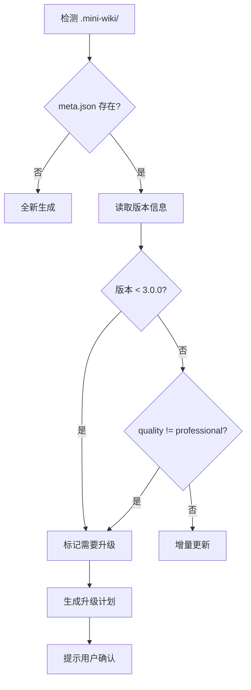

# 文档升级与刷新策略

> 📖 本文件为 [SKILL.md](../SKILL.md) 的详细补充

---

## 版本检测机制

在 `meta.json` 中记录文档生成版本：

```json
{
  "generator_version": "3.0.8",
  "quality_standard": "professional-v2",
  "generated_at": "2026-01-28T21:15:00Z",
  "modules": {
    "core": {
      "version": "1.0.0",
      "quality": "basic",
      "sections": 6,
      "has_diagrams": false,
      "last_updated": "2026-01-20T10:00:00Z"
    }
  }
}
```

**页脚格式**：

```markdown
*由 [Mini-Wiki v{{ MINI_WIKI_VERSION }}](https://github.com/trsoliu/mini-wiki) 自动生成 | {{ GENERATED_AT }}*
```

---

## 质量评估标准

| 质量等级 | 章节数 | 图表数 | 示例数 | 交叉链接 |
|---------|--------|--------|--------|----------|
| `basic` | < 6 | 0 | 0-1 | 无 |
| `standard` | 6-9 | 1 | 1-2 | 部分 |
| `professional` | 10+ | 2+ | 3+ | 完整 |

---

## 升级触发条件



---

## 三种升级策略

### 策略 1: 全量刷新 (`refresh_all`)

适用于：版本差异大、文档质量差

```
用户命令: "刷新全部 wiki" / "refresh all wiki"
```

### 策略 2: 渐进式升级 (`upgrade_progressive`)

适用于：模块多、希望保留部分内容

```
用户命令: "升级 wiki" / "upgrade wiki"
```

### 策略 3: 选择性升级 (`upgrade_selective`)

适用于：只想升级特定模块

```
用户命令: "升级 core 模块文档" / "upgrade core module docs"
```

---

## 升级执行流程

### Step 1: 扫描现有文档

评估每个文档的质量分数，标记需要升级的文档和优先级（HIGH / MEDIUM / LOW）。

### Step 2: 生成升级报告

```
📊 Wiki 升级评估报告

当前版本: 1.0.0 (basic)
目标版本: 3.0.8 (professional)

需要升级的文档:
┌─────────────────┬──────────┬────────┬─────────┬──────────┐
│ 文档            │ 当前章节 │ 目标   │ 缺少图表│ 优先级   │
├─────────────────┼──────────┼────────┼─────────┼──────────┤
│ modules/core.md │ 6        │ 16     │ 是      │ 🔴 高    │
│ modules/api.md  │ 8        │ 16     │ 是      │ 🔴 高    │
│ modules/utils.md│ 10       │ 16     │ 否      │ 🟡 中    │
└─────────────────┴──────────┴────────┴─────────┴──────────┘

👉 输入 "确认升级" 开始，或 "跳过 <文档>" 排除特定文档
```

### Step 3: 保留与合并

升级时保留：
- 用户手动添加的内容（通过 `<!-- user-content -->` 标记）
- 自定义配置
- 历史版本备份到 `cache/backup/`

### Step 4: 渐进式升级执行

```
🔄 正在升级 modules/core.md (1/8)

升级内容:
  ✅ 扩展模块概述 (2句 → 3段)
  ✅ 添加架构位置图
  ✅ 添加核心工作流图
  ✅ 扩展 API 文档 (添加3个示例)
  ✅ 添加最佳实践章节
  ✅ 添加设计决策章节
  ✅ 添加依赖关系图
  ✅ 添加相关文档链接

章节数: 6 → 16 ✅
图表数: 0 → 3 ✅
```

---

## 配置选项

```yaml
# .mini-wiki/config.yaml
upgrade:
  auto_detect: true           # 自动检测需要升级的文档
  backup_before_upgrade: true # 升级前备份
  preserve_user_content: true # 保留用户自定义内容
  user_content_marker: "<!-- user-content -->"
  upgrade_strategy: progressive  # all / progressive / selective
  min_quality: professional   # 最低质量要求
```

---

## 用户命令

| 命令 | 说明 |
|------|------|
| `检查 wiki 质量` / `check wiki quality` | 生成质量评估报告 |
| `升级 wiki` / `upgrade wiki` | 渐进式升级低质量文档 |
| `刷新全部 wiki` / `refresh all wiki` | 重新生成所有文档 |
| `升级 <模块> 文档` / `upgrade <module> docs` | 升级特定模块 |
| `继续升级` / `continue upgrade` | 继续未完成的升级 |
